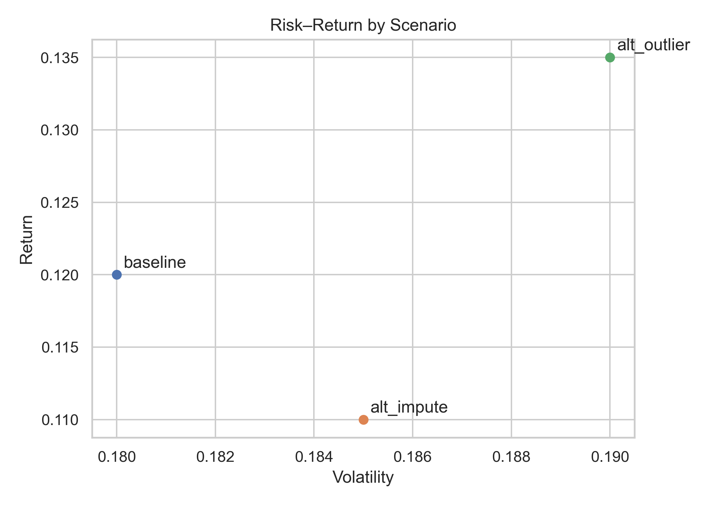

# Final Report — Stakeholder Summary

- Baseline shows ~12% return with ~0.18 volatility.
- Alternate assumptions shift return by −1 to +1.5 pp with modest vol changes.
- Outlier handling is the most influential assumption.

## Key Visuals

​:contentReference[oaicite:0]{index=0}​